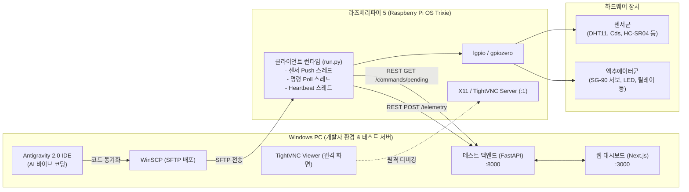

# [실습 교재] 라즈베리파이 5 & Antigravity AI 기반 IoT 캡스톤 프로젝트 바이브 코딩 가이드

> **대상**: 라즈베리파이 5(Raspberry Pi OS Trixie) 기반 IoT 캡스톤 프로젝트를 수행하는 학생  
> **개발 환경**: Windows PC (Antigravity 2.0 IDE, WinSCP, TightVNC) ↔ 라즈베리파이 5  
> **핵심 목표**: AI 코딩 에이전트(Antigravity)와 대화하며 하드웨어 센서/액추에이터 제어 코드 및 REST API 연동 시스템을 구축하는 **바이브 코딩(Vibe Coding)** 기법 습득

---

## 목차 (Table of Contents)

1. [실습 개요 및 아키텍처](#1-실습-개요-및-아키텍처)
2. [사전 준비 및 환경 구축 (Lab 0)](#2-사전-준비-및-환경-구축-lab-0)
3. [AI 에이전트 컨텍스트 확인 및 프로젝트 초기화 (Lab 1)](#3-ai-에이전트-컨텍스트-확인-및-프로젝트-초기화-lab-1)
4. [센서 모듈 구현 및 단독 검증 (Lab 2)](#4-센서-모듈-구현-및-단독-검증-lab-2)
5. [액추에이터 모듈 구현 및 단독 검증 (Lab 3)](#5-액추에이터-모듈-구현-및-단독-검증-lab-3)
6. [REST API 클라이언트 및 메인 런타임 연동 (Lab 4)](#6-rest-api-클라이언트-및-메인-런타임-연동-lab-4)
7. [라즈베리파이 5 배포 및 실기기 테스트 (Lab 5)](#7-라즈베리파이-5-배포-및-실기기-테스트-lab-5)
8. [(선택/심화) 비전 및 QR 코드 인식 트리거 연동 (Lab 6)](#8-선택심화-비전-및-qr-코드-인식-트리거-연동-lab-6)
9. [바이브 코딩 핵심 원칙 & 트러블슈팅 가이드](#9-바이브-코딩-핵심-원칙--트러블슈팅-가이드)
10. [부록: 프롬프트 작성 템플릿 & 카탈로그 규격 치트시트](#10-부록-프롬프트-작성-템플릿--카탈로그-규격-치트시트)

---

## 1. 실습 개요 및 아키텍처

본 실습은 복잡한 하드웨어 레지스터 제어나 네트워크 통신 보일러플레이트 코드를 처음부터 직접 작성하는 대신, **AI 에이전트(Antigravity 2.0)**에게 명확한 요구사항과 하드웨어 핀 맵, API 계약을 지시하여 코드를 생성하고 이를 검증·통합하는 **바이브 코딩(Vibe Coding)** 방식을 학습합니다.

### 1.1 전체 시스템 구조도



### 1.2 핵심 기술 스택 및 제약 사항

* **하드웨어 보드**: Raspberry Pi 5 (RP1 I/O 컨트롤러 탑재)
* **운영체제**: Raspberry Pi OS **Trixie** (Debian 13 기반)
* **GPIO 제어 라이브러리**: `gpiozero` (버전 `>=2.0.1.post3`, 핀팩토리 **`lgpio` 필수**)
* **통신 프로토콜**: REST API (JSON) 기반 (WebSocket/MQTT 미사용)
  * 센서 데이터: 라즈베리파이 → 백엔드로 주기적 **Push** (`POST /api/devices/{id}/telemetry`)
  * 액추에이터 제어: 라즈베리파이가 백엔드 명령을 주기적 **Poll** (`GET /api/devices/{id}/commands/pending`) 후 실행 결과 **ACK** (`POST .../ack`)

---

## 2. 사전 준비 및 환경 구축 (Lab 0)

### 2.1 Windows PC 환경 준비
1. **Antigravity 2.0 IDE** 설치 및 프로젝트 폴더 오픈
2. **WinSCP** 설치 ([winscp.net](https://winscp.net)) - 무료 SFTP GUI 클라이언트
3. **TightVNC Viewer** 설치 ([tightvnc.com](https://www.tightvnc.com)) - 라즈베리파이 원격 화면 뷰어
4. **테스트 백엔드 실행** (Windows PC):
   ```powershell
   cd iot-test-system\backend
   uvicorn app.main:app --reload --host 0.0.0.0 --port 8000
   ```
5. **웹 대시보드 실행** (Windows PC):
   ```powershell
   cd iot-test-system\frontend
   npm run dev
   ```
   * 브라우저에서 `http://localhost:3000` 접속 확인

### 2.2 라즈베리파이 5 환경 설정 (최초 1회)
1. **SSH 활성화**:
   ```bash
   sudo raspi-config
   # Interface Options -> SSH -> Yes 선택
   ```
2. **IP 확인**:
   ```bash
   hostname -I
   # 예: 192.168.0.50
   ```
3. **X11 전환 및 TightVNC Server 설치** (Trixie 기본 Wayland에서 X11로 전환):
   ```bash
   sudo raspi-config
   # Advanced Options -> Wayland -> X11 선택 후 재부팅
   sudo apt update
   sudo apt install -y tightvncserver
   vncserver :1  # 최초 실행 시 비밀번호 설정
   ```
4. **Python 가상환경 및 필수 패키지 설치**:
   ```bash
   mkdir -p ~/project
   cd ~/project
   python3 -m venv .venv
   source .venv/bin/activate
   pip install requests python-dotenv gpiozero lgpio adafruit-circuitpython-dht
   ```

---

## 3. AI 에이전트 컨텍스트 확인 및 프로젝트 초기화 (Lab 1)

Antigravity IDE에서 플러그인과 룰(`AGENTS.md`, `rules/`)이 올바르게 로드되었는지 확인하고 프로젝트의 뼈대를 생성합니다.

### 3.1 플러그인 로드 확인

#### 💬 프롬프트 예시 (입력)
```text
너 지금 이 프로젝트에 대해 뭘 알고 있어? 우리가 쓰는 하드웨어 사양과 백엔드 통신 방식을 설명해줘.
```

#### 🤖 AI 응답 예시 (기대 결과)
> "본 프로젝트는 **라즈베리파이 5(Raspberry Pi OS Trixie)** 기반 IoT 시스템입니다.
> - **GPIO 제어**: RP1 칩셋 특성에 따라 `gpiozero`와 `lgpio` 핀팩토리를 사용합니다.
> - **백엔드 연동**: Windows PC의 FastAPI 테스트 서버와 REST API(JSON)로 통신합니다. 센서는 `POST /telemetry`로 주기적 Push, 액추에이터는 `GET /commands/pending`으로 Poll 후 `POST /ack`를 수행합니다.
> - **카탈로그 규격**: 정해진 센서 8종 및 액추에이터 7종의 데이터 스키마를 엄격히 준수합니다."

---

### 3.2 프로젝트 구조 및 환경변수 템플릿 생성

#### 💬 프롬프트 예시 (입력)
```text
라즈베리파이 5 IoT 클라이언트를 위한 표준 폴더 구조를 만들고 싶어.
sensors/, actuators/ 폴더를 생성하고, .env.example 파일에 BACKEND_URL, DEVICE_ID, API_KEY 항목을 작성해줘.
```

#### 🤖 생성된 파일 결과물: `.env.example`
```ini
# 백엔드 서버 주소 (Windows PC의 IP 주소)
BACKEND_URL=http://192.168.0.10:8000

# 대시보드에서 등록 후 발급받은 디바이스 ID 및 API 키
DEVICE_ID=1
API_KEY=dev_secret_key_123

# 폴링 및 전송 주기 (초 단위)
PUSH_INTERVAL_SEC=2.0
POLL_INTERVAL_SEC=1.0
HEARTBEAT_INTERVAL_SEC=5.0
```

> [!TIP]
> 학생들은 `.env.example`을 복사하여 `.env`를 생성하고, 대시보드에서 발급받은 실제 값(`DEVICE_ID`, `API_KEY`, Windows PC의 IP)을 입력합니다.

---

## 4. 센서 모듈 구현 및 단독 검증 (Lab 2)

센서 코드는 **단일 책임 원칙**에 따라 `sensors/<type_key>.py` 형태로 작성하며, 반드시 `generate() -> dict | None` 함수 또는 `read() -> dict` 메서드를 제공해야 합니다.

### 4.1 DHT11 온습도 센서 모듈

#### 💬 프롬프트 예시 (입력)
```text
라즈베리파이 5의 GPIO4 번 핀에 DHT11 온습도 센서를 연결했어.
카탈로그 계약에 맞게 온도는 temperature_c(°C), 습도는 humidity_pct(%) 키를 가진 딕셔너리를 반환하는 sensors/dht11_sensor.py 코드를 작성해줘.
라즈베리파이 5 핀팩토리 lgpio 설정과 DHT11의 타이밍 오류에 대비한 3회 재시도(Retry) 로직도 포함해줘.
실기기가 없는 PC 환경에서도 에러 없이 가상 데이터가 반환되도록 예외 처리를 넣어줘.
```

#### 🤖 생성된 소스 코드: `sensors/dht11_sensor.py`
```python
import os
import time

# 라즈베리파이 5 필수 핀팩토리 설정
os.environ["GPIOZERO_PIN_FACTORY"] = "lgpio"

try:
    import board
    import adafruit_dht
    HAS_HARDWARE = True
except ImportError:
    HAS_HARDWARE = False

class DHT11Sensor:
    def __init__(self, pin=4):
        self.pin = pin
        self._sensor = None
        if HAS_HARDWARE:
            d_pin = getattr(board, f"D{pin}", board.D4)
            self._sensor = adafruit_dht.DHT11(d_pin, use_pulseio=False)

    def read(self) -> dict:
        """
        카탈로그 계약:
        - temperature_c: float (°C)
        - humidity_pct: float (%)
        """
        if not HAS_HARDWARE or self._sensor is None:
            # 실기기 라이브러리 부재 시 가상 데이터 반환
            return {"temperature_c": 24.5, "humidity_pct": 55.0}

        # DHT11 센서 특성상 간헐적 펄스 에러가 발생하므로 3회 재시도
        for _ in range(3):
            try:
                temp = float(self._sensor.temperature)
                hum = float(self._sensor.humidity)
                return {
                    "temperature_c": round(temp, 1),
                    "humidity_pct": round(hum, 1)
                }
            except RuntimeError:
                time.sleep(1.0)
            except Exception as e:
                print(f"[DHT11] 오류 발생: {e}")
                break

        return {"temperature_c": 0.0, "humidity_pct": 0.0}

    def close(self):
        if self._sensor:
            self._sensor.exit()

# 런타임 호환 함수
_default_sensor = None
def generate() -> dict | None:
    global _default_sensor
    if _default_sensor is None:
        _default_sensor = DHT11Sensor(pin=4)
    return _default_sensor.read()
```

---

### 4.2 Cds 조도 센서 모듈

#### 💬 프롬프트 예시 (입력)
```text
Cds 조도 센서와 1uF 커패시터를 GPIO17에 연결했어 (RC 충전 시간 방식 LightSensor).
카탈로그 계약인 lux(float, 0~2000 lx)를 반환하는 sensors/cds_sensor.py 코드를 작성해줘.
gpiozero.LightSensor를 사용하고, 하드웨어가 없을 때도 450.0 lx의 기본값을 반환하도록 구현해줘.
```

#### 🤖 생성된 소스 코드: `sensors/cds_sensor.py`
```python
import os

os.environ["GPIOZERO_PIN_FACTORY"] = "lgpio"

try:
    from gpiozero import LightSensor
    HAS_HARDWARE = True
except ImportError:
    HAS_HARDWARE = False

class CdsSensor:
    def __init__(self, pin=17):
        self.pin = pin
        self._sensor = None
        if HAS_HARDWARE:
            self._sensor = LightSensor(self.pin)

    def read(self) -> dict:
        """
        카탈로그 계약:
        - lux: float (lx, 0~2000)
        """
        if not HAS_HARDWARE or self._sensor is None:
            return {"lux": 450.0}

        try:
            # 0.0 ~ 1.0 비율을 0 ~ 2000 lx 범위로 환산
            raw_val = self._sensor.value
            lux_val = round(raw_val * 2000.0, 1)
            return {"lux": lux_val}
        except Exception as e:
            print(f"[Cds] 읽기 오류: {e}")
            return {"lux": 0.0}

    def close(self):
        if self._sensor:
            self._sensor.close()

_default_sensor = None
def generate() -> dict | None:
    global _default_sensor
    if _default_sensor is None:
        _default_sensor = CdsSensor(pin=17)
    return _default_sensor.read()
```

---

### 4.3 센서 단독 로컬 테스트 스크립트 작성

전체 서버 연동 전에 센서 모듈이 정상 동작하는지 테스트하는 간이 스크립트를 작성합니다.

#### 💬 프롬프트 예시 (입력)
```text
sensors/dht11_sensor.py와 sensors/cds_sensor.py를 임포트해서 2초 주기로 터미널에 센서 측정값을 깔끔하게 출력해주는 read_sensors.py 스크립트를 작성해줘. Ctrl+C 입력 시 정상 종료되게 close()도 호출해줘.
```

#### 🤖 생성된 소스 코드: `read_sensors.py`
```python
import os
import time
from sensors.dht11_sensor import DHT11Sensor
from sensors.cds_sensor import CdsSensor

os.environ["GPIOZERO_PIN_FACTORY"] = "lgpio"

def main():
    dht_sensor = DHT11Sensor(pin=4)
    cds_sensor = CdsSensor(pin=17)

    print("========================================")
    print("  라즈베리파이 5 센서 측정 시작 (Ctrl+C 종료)")
    print("  - DHT11: GPIO4")
    print("  - Cds  : GPIO17")
    print("========================================")

    try:
        while True:
            dht_data = dht_sensor.read()
            cds_data = cds_sensor.read()

            print(f"[온습도] 온도: {dht_data['temperature_c']}°C, 습도: {dht_data['humidity_pct']}% | "
                  f"[조도] {cds_data['lux']} lx")

            time.sleep(2.0)
    except KeyboardInterrupt:
        print("\n측정을 종료합니다.")
    finally:
        dht_sensor.close()
        cds_sensor.close()

if __name__ == "__main__":
    main()
```

---

## 5. 액추에이터 모듈 구현 및 단독 검증 (Lab 3)

액추에이터는 백엔드에서 전달받은 `desired_state` 딕셔너리를 입력받아 물리 제어를 수행하고, 실제 반영된 상태 `actual_state` 딕셔너리를 반환하는 `apply(desired: dict) -> dict` 함수를 구현합니다.

### 5.1 SG-90 서보모터 모듈

#### 💬 프롬프트 예시 (입력)
```text
SG-90 마이크로 서보모터를 GPIO18에 연결했어.
카탈로그 계약에 따라 desired 딕셔너리에서 angle_deg(0~180도)를 받아 각도를 변경하고, 실제 설정된 각도를 반환하는 actuators/servo.py 코드를 작성해줘.
gpiozero.AngularServo를 사용하고, SG-90의 펄스 폭(min_pulse_width=0.0005, max_pulse_width=0.0024)을 지정해줘.
```

#### 🤖 생성된 소스 코드: `actuators/servo.py`
```python
import os
import time

os.environ["GPIOZERO_PIN_FACTORY"] = "lgpio"

try:
    from gpiozero import AngularServo
    HAS_HARDWARE = True
except ImportError:
    HAS_HARDWARE = False

class ServoActuator:
    def __init__(self, pin=18):
        self.pin = pin
        self._servo = None
        self.current_angle = 90.0
        if HAS_HARDWARE:
            # SG-90 전용 펄스 폭 튜닝
            self._servo = AngularServo(
                self.pin,
                min_angle=0,
                max_angle=180,
                min_pulse_width=0.0005,
                max_pulse_width=0.0024
            )
            self._servo.angle = self.current_angle

    def apply(self, desired: dict) -> dict:
        """
        카탈로그 계약:
        - angle_deg: float (0~180)
        """
        angle = float(desired.get("angle_deg", self.current_angle))
        angle = max(0.0, min(180.0, angle))
        self.current_angle = angle

        if HAS_HARDWARE and self._servo is not None:
            self._servo.angle = angle
            time.sleep(0.3)  # 모터 회전 도달 대기

        return {"angle_deg": self.current_angle}

    def close(self):
        if self._servo:
            self._servo.close()

_default_actuator = None
def apply(desired: dict) -> dict:
    global _default_actuator
    if _default_actuator is None:
        _default_actuator = ServoActuator(pin=18)
    return _default_actuator.apply(desired)
```

---

### 5.2 LED 및 PWM 밝기 제어 모듈

#### 💬 프롬프트 예시 (입력)
```text
GPIO22에 연결된 LED를 제어하는 actuators/led.py를 만들어줘.
카탈로그 계약: on(bool), brightness_pct(float, 0~100).
gpiozero.PWMLED를 사용해 밝기 조절이 가능하도록 해줘.
```

#### 🤖 생성된 소스 코드: `actuators/led.py`
```python
import os

os.environ["GPIOZERO_PIN_FACTORY"] = "lgpio"

try:
    from gpiozero import PWMLED
    HAS_HARDWARE = True
except ImportError:
    HAS_HARDWARE = False

class LedActuator:
    def __init__(self, pin=22):
        self.pin = pin
        self.is_on = False
        self.brightness_pct = 100.0
        self._led = PWMLED(pin) if HAS_HARDWARE else None

    def apply(self, desired: dict) -> dict:
        if "on" in desired:
            self.is_on = bool(desired["on"])
        if "brightness_pct" in desired:
            self.brightness_pct = float(desired["brightness_pct"])

        if HAS_HARDWARE and self._led:
            if self.is_on:
                self._led.value = max(0.0, min(1.0, self.brightness_pct / 100.0))
            else:
                self._led.off()

        return {"on": self.is_on, "brightness_pct": self.brightness_pct}

_default_led = None
def apply(desired: dict) -> dict:
    global _default_led
    if _default_led is None:
        _default_led = LedActuator(pin=22)
    return _default_led.apply(desired)
```

---

## 6. REST API 클라이언트 및 메인 런타임 연동 (Lab 4)

### 6.1 REST API 클라이언트 (`client.py`)

#### 💬 프롬프트 예시 (입력)
```text
FastAPI 백엔드 서버와 통신할 client.py를 작성해줘.
요구사항:
1. X-Device-Key 헤더에 API_KEY 인증 포함
2. 컴포넌트 목록 조회: GET /api/devices/{device_id}/components
3. 텔레메트리 전송: POST /api/devices/{device_id}/telemetry (payload: {"items": [{"component_id": int, "value": dict}]})
4. 대기 명령 폴링: GET /api/devices/{device_id}/commands/pending
5. 명령 결과 응답: POST /api/devices/{device_id}/commands/{command_id}/ack
6. 하트비트 전송: POST /api/devices/{device_id}/heartbeat
```

#### 🤖 생성된 소스 코드: `client.py`
```python
import requests

class BackendClient:
    def __init__(self, base_url: str, device_id: int, api_key: str, timeout: float = 5.0):
        self.base_url = base_url.rstrip("/")
        self.device_id = device_id
        self.timeout = timeout
        self._headers = {"X-Device-Key": api_key}

    def _url(self, path: str) -> str:
        return f"{self.base_url}/api/devices/{self.device_id}{path}"

    def list_components(self) -> list[dict]:
        resp = requests.get(self._url("/components"), timeout=self.timeout)
        resp.raise_for_status()
        return resp.json()

    def push_telemetry(self, items: list[dict]) -> None:
        if not items:
            return
        resp = requests.post(
            self._url("/telemetry"),
            json={"items": items},
            headers=self._headers,
            timeout=self.timeout,
        )
        resp.raise_for_status()

    def pending_commands(self) -> list[dict]:
        resp = requests.get(
            self._url("/commands/pending"), headers=self._headers, timeout=self.timeout
        )
        resp.raise_for_status()
        return resp.json()

    def ack_command(self, command_id: int, actual_state: dict, status: str = "acked") -> None:
        resp = requests.post(
            self._url(f"/commands/{command_id}/ack"),
            json={"actual_state": actual_state, "status": status},
            headers=self._headers,
            timeout=self.timeout,
        )
        resp.raise_for_status()

    def heartbeat(self) -> None:
        resp = requests.post(
            self._url("/heartbeat"), headers=self._headers, timeout=self.timeout
        )
        resp.raise_for_status()
```

---

### 6.2 메인 런타임 (`run.py`) 구현

#### 💬 프롬프트 예시 (입력)
```text
sensors/ 및 actuators/ 폴더의 모듈을 동적으로 자동 탐색해서 등록하고,
독립된 백그라운드 스레드로 다음 작업을 수행하는 메인 실행 파일 run.py를 작성해줘:
1. sync_loop: 15초마다 서버 컴포넌트 목록 동기화
2. sensor_loop: 2초마다 센서 데이터 수집 후 push_telemetry()
3. command_loop: 1초마다 pending_commands() 확인 후 액추에이터 apply() 및 ack_command()
4. heartbeat_loop: 5초마다 heartbeat() 전송
.env 파일에서 BACKEND_URL, DEVICE_ID, API_KEY를 자동 로드하고 명령줄 인자(argparse)로도 오버라이드할 수 있게 해줘.
```

#### 🤖 핵심 로직 검증 포인트
- `sensors/*.py`의 `generate()` 함수와 `actuators/*.py`의 `apply()` 함수를 백엔드의 `type_key`와 1:1로 매핑
- 스레드 세이프(`threading.Lock`)한 컴포넌트 목록 관리
- 예외 발생 시 전체 프로그램이 비정상 종료되지 않고 로그를 남기며 복구되도록 처리

---

## 7. 라즈베리파이 5 배포 및 실기기 테스트 (Lab 5)

### 7.1 WinSCP를 통한 배포 절차

```text
[Windows PC (Antigravity)]              [라즈베리파이 5]
  D:\my-pi-project\                     /home/pi/project/
   ├── sensors/        ===============>   ├── sensors/
   ├── actuators/       (WinSCP SFTP)     ├── actuators/
   ├── client.py                          ├── client.py
   ├── run.py                             ├── run.py
   └── read_sensors.py                    └── .env (라즈베리파이에서 직접 생성)
```

1. **WinSCP 실행 및 접속**:
   * 호스트: 라즈베리파이 IP (예: `192.168.0.50`), 포트: `22`
   * 사용자명/비밀번호: `pi` / 설정한 비밀번호
2. **동기화 (Synchronize)**:
   * Windows 작업 폴더에서 라즈베리파이의 `/home/pi/project/`로 코드 복사
   * `Commands` → `Synchronize`로 변경된 파일만 원클릭 반영
3. **라즈베리파이 환경변수(`.env`) 설정**:
   * 라즈베리파이 터미널에서 `.env` 생성 (Windows PC IP 지정):
     ```bash
     nano /home/pi/project/.env
     ```
     ```ini
     BACKEND_URL=http://192.168.0.10:8000
     DEVICE_ID=1
     API_KEY=dev_secret_key_123
     ```

### 7.2 실기기 실행 및 대시보드 검증

1. **라즈베리파이 터미널에서 실행**:
   ```bash
   cd ~/project
   source .venv/bin/activate
   python run.py
   ```
2. **웹 대시보드(`http://localhost:3000`) 확인**:
   * 디바이스 상태가 **ONLINE**으로 변경되는지 확인 (하트비트 정상)
   * DHT11 온도/습도 그래프 및 Cds 조도 센서 실시간 수치 확인
   * 서보모터 슬라이더를 0° → 90° → 180°로 조작 시 실제 모터가 회전하고 대시보드에 상태가 `ACK`되는지 확인

---

## 8. (선택/심화) 비전 및 QR 코드 인식 트리거 연동 (Lab 6)

프로젝트에 카메라를 이용한 QR 코드 인식이나 객체 인식이 필요한 경우 두 가지 아키텍처 중 하나를 선택합니다.

### 8.1 아키텍처 선택 가이드

| 방식 | 설명 | 장점 | 적합한 경우 |
|---|---|---|---|
| **옵션 A: 라즈베리파이 직접 연산** | Pi 5에서 OpenCV / Picamera2로 직접 QR 디코딩 후 텔레메트리 전송 | 네트워크 트래픽 적음, 독립 구동 가능 | QR 코드, 경량 이미지 처리 |
| **옵션 B: 백엔드 오프로드** | Pi는 카메라 캡처만 하고 이미지를 백엔드(`POST /api/vision/qr`)로 전송해 결과 수신 | Pi 연산 부담 최소화, 고성능 모델 구동 가능 | 무거운 YOLOv8 모델, 복잡한 비전 인식 |

#### 💬 프롬프트 예시 (옵션 A - QR 스캐너 구현)
```text
라즈베리파이 카메라(Picamera2) 또는 USB 웹캠으로 QR 코드를 인식하는 sensors/qr_scanner.py 모듈을 작성해줘.
카탈로그 계약: {"detected": bool, "payload": str}.
OpenCV의 cv2.QRCodeDetector()를 사용하고, QR코드가 감지되면 payload에 문자열을 담고 없으면 detected=False, payload=""를 반환하게 해줘.
```

---

## 9. 바이브 코딩 핵심 원칙 & 트러블슈팅 가이드

### 9.1 바이브 코딩 3대 검증 원칙 (AI 코드를 맹신하지 말 것!)

1. **카탈로그 필드명 대소문자/단위 검증**:
   * AI가 `temperature` 대신 임의로 `temp`라고 작성하면 대시보드에 데이터가 표시되지 않습니다. 반드시 `temperature_c`, `humidity_pct`, `lux`, `distance_cm` 등 정확한 규격을 확인하세요.
2. **라즈베리파이 5 핀팩토리 지정 여부**:
   * `os.environ["GPIOZERO_PIN_FACTORY"] = "lgpio"` 코드가 파일 상단에 존재하는지 확인하세요. 누락 시 RP1 칩셋 에러(`BadPinFactory`)가 발생합니다.
3. **GPIO 핀 번호 충돌 확인**:
   * 하나의 GPIO 핀에 센서와 액추에이터가 중복 할당되지 않았는지 점검하세요.

---

### 9.2 자주 발생하는 오류와 해결 방법

| 증상 | 원인 | 해결 방법 |
|---|---|---|
| `AttributeError: pin_factory` 또는 `BadPinFactory` | 구형 RPi.GPIO 사용 시도 | 코드 상단에 `os.environ["GPIOZERO_PIN_FACTORY"] = "lgpio"` 추가 및 `pip install lgpio` |
| 대시보드에 센서 수치가 나타나지 않음 | 1. 텔레메트리 필드명 불일치<br/>2. API 키 불일치 (401 에러) | `rules/02-catalog-contract.md`와 키 이름 대조, `.env`의 `API_KEY` 일치 여부 확인 |
| 서보모터가 덜덜 떨리거나 회전하지 않음 | 1. 전원 부족 (5V 2A 이상 별도 전원 권장)<br/>2. PWM 펄스 폭 불일치 | `AngularServo`의 `min_pulse_width=0.0005`, `max_pulse_width=0.0024` 파라미터 적용 |
| WinSCP 접속 불가 | 라즈베리파이 SSH 비활성화 | `sudo raspi-config` → Interface Options → SSH 활성화 |
| TightVNC 접속 화면이 까맣게 나옴 | Wayland 환경 충돌 | `raspi-config` → Advanced Options → Wayland를 X11로 변경 후 재부팅 |

---

## 10. 부록: 프롬프트 작성 템플릿 & 카탈로그 규격 치트시트

### 10.1 AI에게 효과적인 프롬프트 작성 템플릿

```text
[역할 & 대상 하드웨어]
우리는 라즈베리파이 5 (OS: Trixie) 환경에서 Python 3 및 gpiozero(lgpio 핀팩토리)를 사용하고 있어.

[하드웨어 배선 정보]
부품 이름: <예: 초음파 센서 HC-SR04>
연결 핀: <예: TRIG = GPIO23, ECHO = GPIO24>

[요구하는 카탈로그 계약]
파일 위치: <예: sensors/hcsr04.py>
반환 포맷: {"<필드명>": <타입>} <예: {"distance_cm": float}>

[특수 조건 & 예외 처리]
- 하드웨어가 연결되지 않은 PC에서도 mock 데이터가 반환되도록 try-except 처리
- 값이 튀거나 읽기 실패 시 재시도 로직 포함
```

---

### 10.2 카탈로그 규격 치트시트

#### 📊 센서 규격 (Sensors)
| `type_key` | 센서명 | payload 필드 정의 | 예시 데이터 |
|---|---|---|---|
| `dht11` | 온습도센서 | `temperature_c` (float, °C)<br/>`humidity_pct` (float, %) | `{"temperature_c": 24.5, "humidity_pct": 55.0}` |
| `illuminance` | 조도센서 | `lux` (float, lx, 0~2000) | `{"lux": 520.0}` |
| `hcsr04` | 초음파센서 | `distance_cm` (float, cm, 2~400) | `{"distance_cm": 15.4}` |
| `push_button` | 푸시버튼 | `pressed` (bool) | `{"pressed": true}` |
| `flame` | 불꽃센서 | `detected` (bool)<br/>`intensity` (float, 0~100) | `{"detected": true, "intensity": 82.5}` |
| `qr_scanner` | QR스캐너 | `detected` (bool)<br/>`payload` (string) | `{"detected": true, "payload": "ENTRY_PASS_01"}` |

#### ⚙️ 액추에이터 규격 (Actuators)
| `type_key` | 액추에이터명 | payload 필드 정의 | 예시 데이터 |
|---|---|---|---|
| `led` | LED | `on` (bool)<br/>`brightness_pct` (float, 0~100) | `{"on": true, "brightness_pct": 80.0}` |
| `servo` | 서보모터 | `angle_deg` (float, deg, 0~180) | `{"angle_deg": 90.0}` |
| `buzzer` | 부저 | `on` (bool)<br/>`freq_hz` (int, Hz, 100~5000) | `{"on": true, "freq_hz": 1000}` |
| `relay` | 릴레이 | `on` (bool) | `{"on": true}` |
| `dc_motor` | DC모터 | `speed_pct` (float, -100~100) | `{"speed_pct": 75.0}` |
